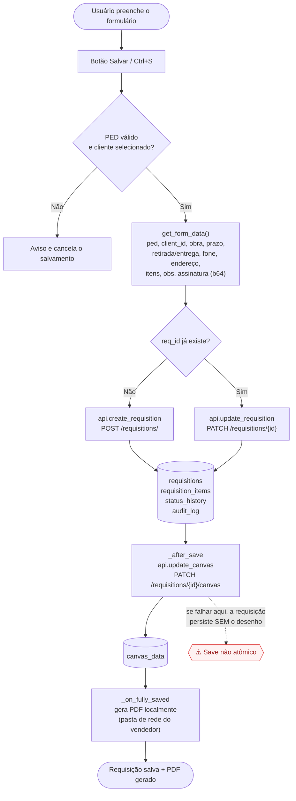
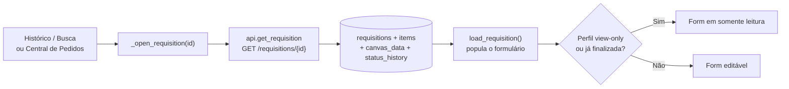
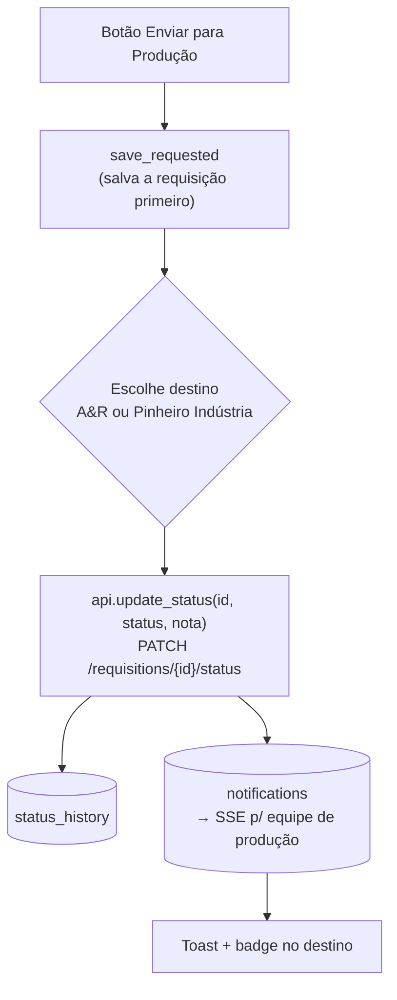
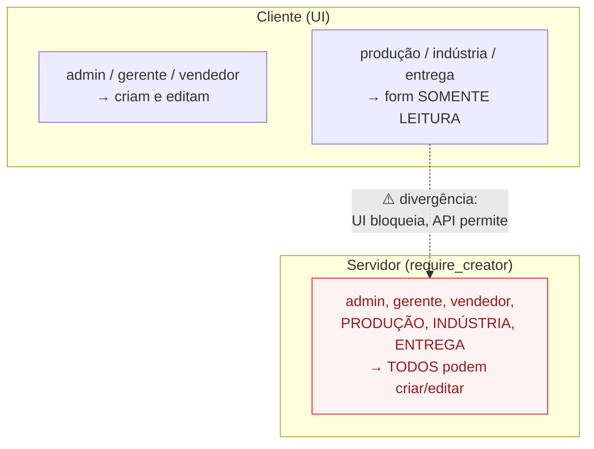

# Fluxograma — Nova Requisição

> Tela: `client/views/requisition_form.py` · Save flow: `client/views/main_window.py`
> Backend: `server/routers/requisitions.py` · Schema/Model: `schemas/requisition.py`, `models/requisition.py`
>
> Os diagramas abaixo estão em [Mermaid](https://mermaid.js.org/) — renderizam automaticamente no GitHub.

---

## 1. Fluxo principal — Salvar requisição



---

## 2. Busca de cliente e lookup de produto (auxiliares, só leitura)

```mermaid
flowchart LR
    T[Digita no campo de cliente] --> LC["api.list_clients(termo)<br/>GET /clients/?search="]
    LC --> CL[("tabela clients")]
    CL --> PICK[Usuário escolhe<br/>→ guarda apenas client_id]

    IT[Digita código do produto na linha] --> LP["api.list_products(code)<br/>GET /products/?code="]
    LP --> PR[("tabela products")]
    PR --> FILL[Preenche product_name na linha<br/>(texto livre — sem vínculo persistente)]
```

---

## 3. Abrir requisição existente



---

## 4. Enviar para produção



---

## 5. Mapa de permissões (resumo)



---

## Legenda de riscos destacados

| ⚠️ | Onde | Resumo |
|----|------|--------|
| Save não atômico | Diagrama 1 | Desenho (canvas) salvo em chamada separada; se falhar, requisição fica sem o desenho. |
| Permissão UI × API | Diagrama 5 | `require_creator` libera produção/indústria/entrega que a UI bloqueia. |

> Detalhamento completo em [`01-nova-requisicao-auditoria.md`](./01-nova-requisicao-auditoria.md).
